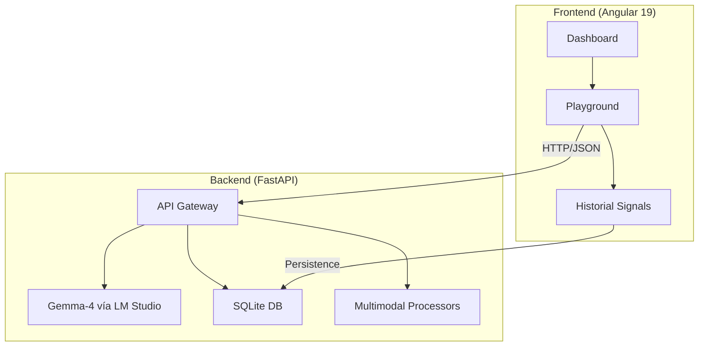

# 🦾 OracleAI - Global Community Hub

<div align="center">


**Un asistente multimodal para comunidades globales. Educación + Salud. Offline. Privado.**

[🎥 Ver Demo](https://youtu.be/QhuEDGV3O8o) • [📚 Documentación](#) • [🐛 Reportar Bug](https://github.com/vertexcoders/oracleai/issues)

</div>

---

## 📋 Tabla de Contenidos

- [🌟 Visión General](#-visión-general)
- [🎯 El Problema que Resolvemos](#-el-problema-que-resolvemos)
- [💡 Nuestra Solución](#-nuestra-solución)
- [✨ Características Principales](#-características-principales)
- [🏗️ Arquitectura Técnica](#️-arquitectura-técnica)
- [🖥️ Requisitos de Hardware](#️-requisitos-de-hardware)
- [🚀 Instalación Rápida](#-instalación-rápida)
- [🎮 Uso y Modos](#-uso-y-modos)
- [🤝 Contribuciones](#-contribuciones)
- [📄 Licencia](#-licencia)

---

## 🌟 Visión General

**OracleAI** es un asistente inteligente multimodal diseñado para comunidades remotas sin acceso confiable a internet. Corre completamente **offline** en hardware de bajo costo y ofrece capacidades de **educación** para niños y **salud preventiva** para adultos mayores.

> *"Una familia. Un dispositivo. Educación para los niños. Salud para los ancianos. Eso es OracleAI."*

---

## 🎯 El Problema que Resolvemos

En comunidades rurales alrededor del mundo enfrentamos una brecha digital crítica:
- 📡 **1,500 millones** de personas sin internet.
- 🎓 **250 millones** de niños fuera del sistema escolar.
- 🏥 **100 millones** de ancianos sin salud básica.
- 📱 Familias con **un solo dispositivo** que deben elegir entre educación o salud.

---

## 💡 Nuestra Solución

OracleAI rompe esa barrera con un sistema que:
- ✅ **100% Offline**: Privacidad y disponibilidad total.
- ✅ **Multimodal**: Ve, escucha, analiza y lee.
- ✅ **Adaptativo**: Modos específicos para niños (vibrante) y ancianos (calmado).
- ✅ **Bajo Costo**: Optimizado para Raspberry Pi 5 (~$80 USD).

---

## ✨ Características Principales

### 🎓 Modo Educación
- **Análisis Matemático**: Resuelve problemas escritos a mano mediante visión.
- **Identificación Visual**: Reconoce animales, plantas y objetos para aprendizaje interactivo.
- **Agentes Especialistas**: Módulos dedicados a Historia, Geografía, Programación y Artes.

### 🏥 Modo Salud
- **Primeros Auxilios**: Análisis visual de erupciones o heridas.
- **Gestión de Síntomas**: Transcripción y preparación de reportes para médicos.
- **Verificación de Medicación**: Recordatorios con validación visual por cámara.

### 👁️ Visión Continua (Live Vision)
- **Modo Centinela**: Análisis de escena en tiempo real cada 8-10 segundos.
- **Detector de Cambios**: Solo alerta cuando detecta variaciones significativas en el entorno.

### 🎙️ Entrada Multimodal Completa
- **Imágenes/Video**: JPG, PNG, MP4, AVI y soporte para URLs de YouTube.
- **Audio**: MP3, WAV y grabación en vivo con transcripción local.
- **Documentos**: Procesamiento de PDF, DOCX, CSV y JSON.

---

## 🏗️ Arquitectura Técnica



---

## 🖥️ Requisitos de Hardware

| Componente | Recomendado | Mínimo |
| :--- | :--- | :--- |
| **CPU** | Apple M2/M3 o Intel i7 12th Gen | Raspberry Pi 5 (8GB) |
| **GPU/VRAM** | 16GB+ VRAM (RTX 3060+) | 8GB Shared RAM |
| **Almacenamiento** | 50GB SSD NVMe | 32GB MicroSD Class 10 |
| **Cámara** | Webcam 1080p | Módulo Cámara Pi v2 |

---

## 🚀 Instalación Rápida

### 1. Backend (FastAPI)
```bash
cd backend
python -m venv venv
source venv/bin/activate  # venv\Scripts\activate en Windows
pip install -r requirements.txt
uvicorn main:app --reload --port 8080
```

### 2. Frontend (Angular 19)
```bash
cd frontend
npm install
ng serve
```

### 3. Modelo (LM Studio)
1. Descarga e instala [LM Studio](https://lmstudio.ai/).  
2. Busca y descarga `Gemma-4-26b-a4b`.  
3. Inicia el "Local Server" en el puerto `1234`.

---

## 📄 Licencia

Este proyecto está bajo la Licencia MIT — mira el archivo [LICENSE](LICENSE) para más detalles.

---

<div align="center">
Desarrollado con ❤️ por <b>Vertex Coders LLC</b>
</div>