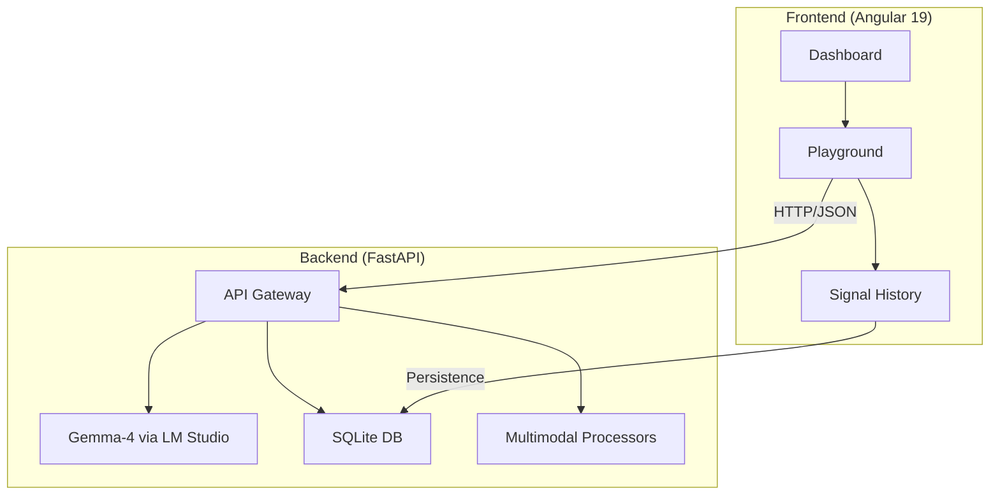

# 🦾 OracleAI

<div align="center">


**A multimodal offline assistant for education and healthcare in low-connectivity communities.**

[🎥 Demo](https://youtu.be/QhuEDGV3O8o) • [🐛 Issues](https://github.com/vertexcoders/oracleai/issues) • [📄 License](LICENSE)

</div>

---

## Description

OracleAI is a multimodal assistant designed to run **100% offline** on low-cost hardware. It is built to support children’s education and preventive healthcare in communities with limited internet access.

## Features

- **Education mode** for math, visual recognition, and interactive learning.
- **Healthcare mode** for first aid, symptom tracking, and medication reminders.
- **Live vision** for real-time monitoring.
- **Multimodal input**: images, video, audio, and documents.
- **Local privacy** without relying on cloud services.

## Architecture



## Hardware Requirements

| Component | Recommended | Minimum |
| :--- | :--- | :--- |
| CPU | Apple M2/M3 or Intel i7 12th Gen | Raspberry Pi 5 (8GB) |
| GPU/VRAM | 16GB+ VRAM (RTX 3060+) | 8GB Shared RAM |
| Storage | 50GB SSD NVMe | 32GB Class 10 MicroSD |
| Camera | 1080p Webcam | Raspberry Pi Camera Module v2 |

## Quick Start

### Backend
```bash
cd backend
python -m venv venv
source venv/bin/activate
pip install -r requirements.txt
uvicorn main:app --reload --port 8080
```

### Frontend
```bash
cd frontend
npm install
ng serve
```

### Model
1. Download and install [LM Studio](https://lmstudio.ai/).
2. Download `Gemma-4-26b-a4b`.
3. Start the local server on port `1234`.

## Use Cases

- Children’s education.
- Basic healthcare triage.
- Continuous visual monitoring.

## Contributing

If you'd like to contribute:
1. Fork the repository.
2. Create a new branch.
3. Open a Pull Request.

## License

This project is licensed under the MIT License. See the [LICENSE](LICENSE) file for details.