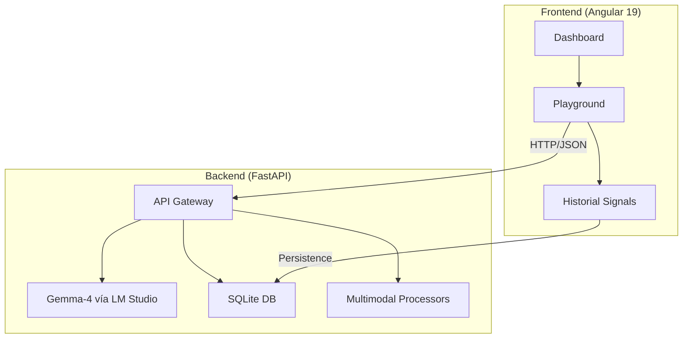

# 🦾 OracleAI

<div align="center">


**Asistente multimodal offline para educación y salud en comunidades con conectividad limitada.**

[🎥 Demo](https://youtu.be/QhuEDGV3O8o) • [🐛 Issues](https://github.com/vertexcoders/oracleai/issues) • [📄 License](LICENSE)

</div>

---

## Descripción

OracleAI es un asistente multimodal diseñado para funcionar **100% offline** en hardware de bajo costo. Está pensado para apoyar educación infantil y salud preventiva en comunidades con acceso limitado a internet.

## Características

- **Modo educación** para matemáticas, reconocimiento visual y aprendizaje interactivo.
- **Modo salud** para primeros auxilios, síntomas y recordatorios de medicación.
- **Visión continua** para monitoreo en tiempo real.
- **Entrada multimodal**: imágenes, video, audio y documentos.
- **Privacidad local** sin depender de servicios en la nube.

## Arquitectura



## Requisitos

| Componente | Recomendado | Mínimo |
| :--- | :--- | :--- |
| CPU | Apple M2/M3 o Intel i7 12th Gen | Raspberry Pi 5 (8GB) |
| GPU/VRAM | 16GB+ VRAM (RTX 3060+) | 8GB Shared RAM |
| Almacenamiento | 50GB SSD NVMe | 32GB MicroSD Class 10 |
| Cámara | Webcam 1080p | Módulo Cámara Pi v2 |

## Instalación rápida

### Backend
```bash
cd backend
python -m venv venv
source venv/bin/activate
pip install -r requirements.txt
uvicorn main:app --reload --port 8080
```

### Frontend
```bash
cd frontend
npm install
ng serve
```

### Modelo
1. Descarga e instala [LM Studio](https://lmstudio.ai/).
2. Descarga `Gemma-4-26b-a4b`.
3. Inicia el servidor local en el puerto `1234`.

## Uso

Describe aquí 2 o 3 casos reales de uso:
- Educación para niños.
- Triaje básico de salud.
- Análisis visual continuo.

## Contribuciones

Si quieres contribuir:
1. Haz un fork del repo.
2. Crea una rama nueva.
3. Abre un Pull Request.

## Licencia

Proyecto bajo licencia MIT. Consulta el archivo [LICENSE](LICENSE).